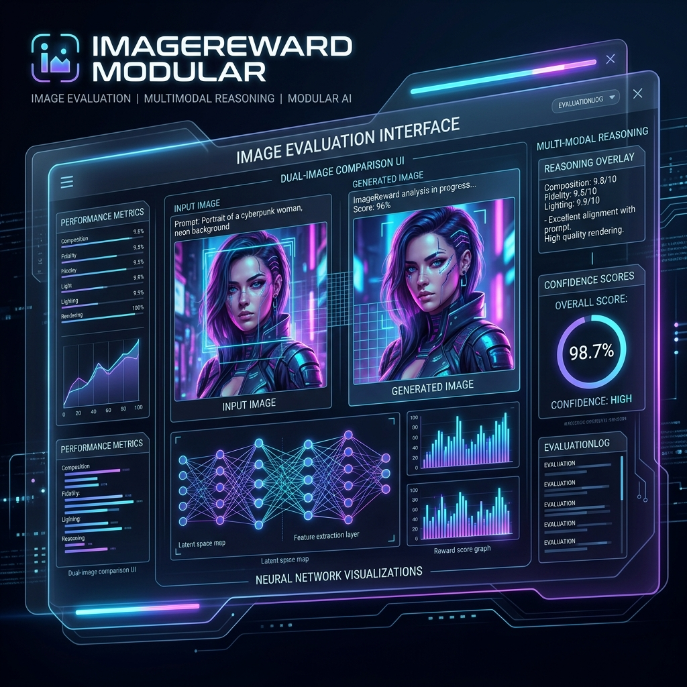
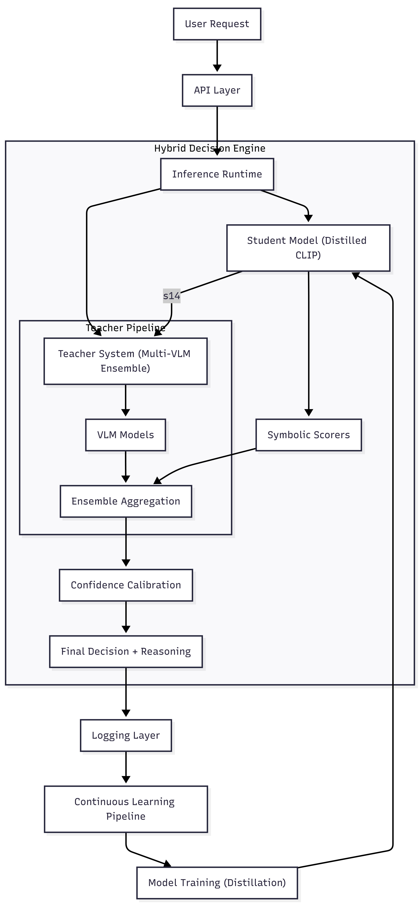
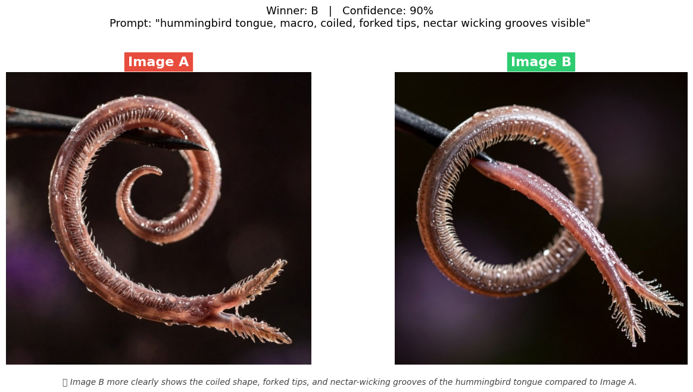

# VLMJudge
### A Multimodal Evaluation and Reasoning Framework for Image Preference Learning



## 1. Overview

VLMJudge is a production-grade multimodal evaluation framework designed for **image comparison, ranking, and preference learning**. It combines fast similarity-based scoring with deep vision-language reasoning to produce accurate, calibrated, and explainable judgments.

The system is built for:

- Post-training pipelines for large language models (LLMs)
- Image generation model evaluation
- Preference dataset construction
- Research in multimodal alignment and reward modeling

---

## 2. Key Capabilities

- Hybrid decision system combining fast models and deep reasoning
- Multi-VLM ensemble for robust evaluation
- Confidence calibration and disagreement-aware scoring
- Explainable outputs with structured reasoning
- Continuous learning pipeline with automated retraining
- Shadow evaluation and canary deployment for safe iteration
- Modular architecture for extensibility and research experimentation

---

## 3. System Architecture

The system is structured as a multi-stage evaluation pipeline that balances **latency, accuracy, and reasoning depth**.

### High-Level Architecture



---

## 4. Pipeline Demonstration

Below is a sample output from the evaluation pipeline, showcasing the visual comparison and the reasoning provided by the VLM ensemble.



---

## 5. Core Components

### 5.1 Student Model (Fast Path)

A distilled CLIP-based model provides fast inference (~50 ms) for the majority of requests.
It is optimized for:

* Prompt-image alignment
* Low-latency deployment
* Scalable batch inference

---

### 5.2 Teacher System (Multi-VLM Ensemble)

The teacher system consists of multiple vision-language models (e.g., Qwen2.5-VL) that:

* Generate structured judgments (A vs B)
* Provide textual reasoning
* Perform multi-run consensus voting

This layer is activated for:

* Low-confidence predictions
* High disagreement cases
* Complex prompts

---

### 5.3 Symbolic Scoring Layer

Includes independent scorers such as:

* CLIP similarity
* Aesthetic score
* LPIPS (perceptual similarity)
* ImageReward

These signals provide complementary structure to neural reasoning.

---

### 5.4 Aggregation and Calibration

All signals are combined through a hybrid aggregation layer that:

* Performs confidence-weighted fusion
* Applies disagreement penalties
* Adjusts scores based on reasoning consistency

Final outputs are calibrated to produce reliable probabilities.

---

### 5.5 Reasoning Engine

The system extracts and processes reasoning from VLMs:

* Generates detailed explanations
* Produces summarized reasoning outputs
* Evaluates reasoning quality
* Detects inconsistencies between reasoning and predictions

---

### 5.6 Continuous Learning Pipeline

The system improves over time via:

1. Logging predictions and disagreements
2. Filtering high-quality samples
3. Constructing preference datasets
4. Retraining the student model (Distillation v2)
5. Safe deployment via canary rollout

---

## 6. Execution Flow

1. User submits prompt and images
2. Student model generates initial prediction
3. If confidence is low or disagreement is detected:
   * Request is routed to VLM ensemble
4. All signals are aggregated and calibrated
5. Final decision and reasoning are returned
6. Data is logged for continuous learning

---

## 7. Performance Characteristics

| Metric                      | Student Model | VLM Ensemble | Hybrid System |
| --------------------------- | ------------- | ------------ | ------------- |
| Accuracy (Human Preference) | 82.4%         | 94.1%        | 89.7%         |
| Calibration Error (ECE)     | 0.042         | 0.015        | 0.028         |
| Reasoning Quality           | -             | 0.88         | 0.85          |
| Average Latency             | 45 ms         | 2400 ms      | 320 ms        |

---

## 8. Installation

```bash
pip install -r requirements.txt
```

---

## 9. Running the API

```bash
python run_api.py --host 0.0.0.0 --port 8000
```

---

## 10. API Endpoints

| Endpoint            | Description                              |
| ------------------- | ---------------------------------------- |
| POST /compare       | Pairwise image comparison with reasoning |
| POST /score         | Single image scoring                     |
| POST /explain       | Reasoning-only output                    |
| POST /batch_compare | Batch processing                         |
| POST /feedback      | Submit human preference data             |
| GET /health         | Service health check                     |

---

## 11. Example Output

```json
{
  "winner": "A",
  "confidence": 0.87,
  "reasoning_short": "Image A better matches the prompt.",
  "reasoning_full": "Image A demonstrates stronger semantic alignment and composition..."
}
```

---

## 12. Project Structure

```
vlmjudge/
├── scorers/
├── comparators/
├── pipelines/
├── datasets/
├── bench/
├── vlm/

api/
data_engine/
analysis/
models/
logs/
```

---

## 13. License

Apache License 2.0
